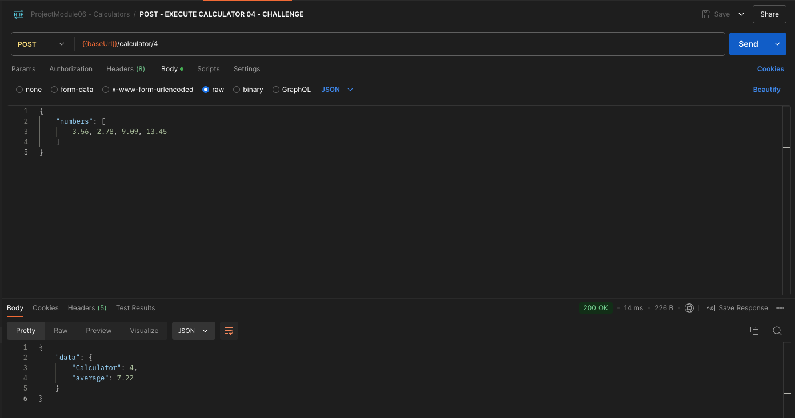
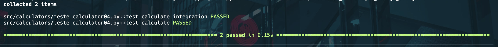
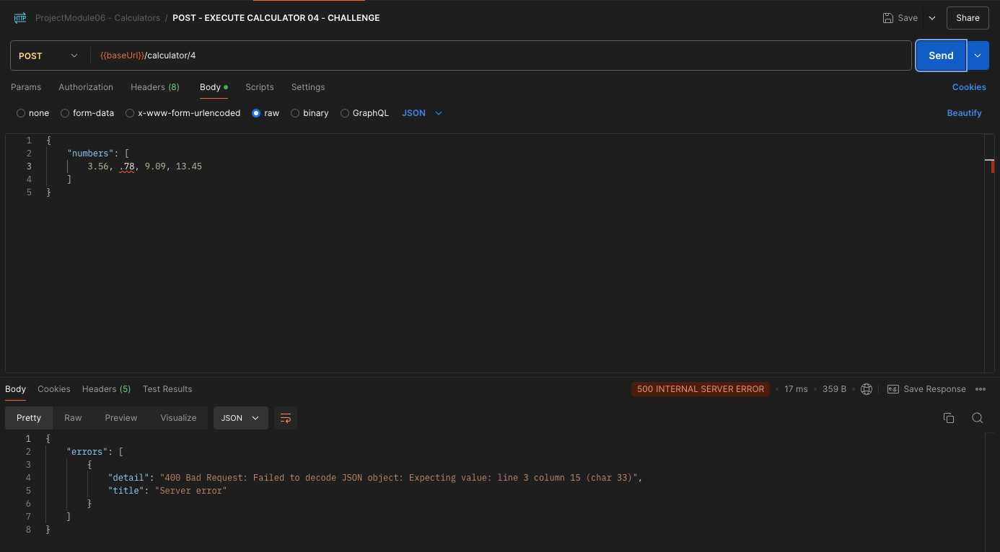
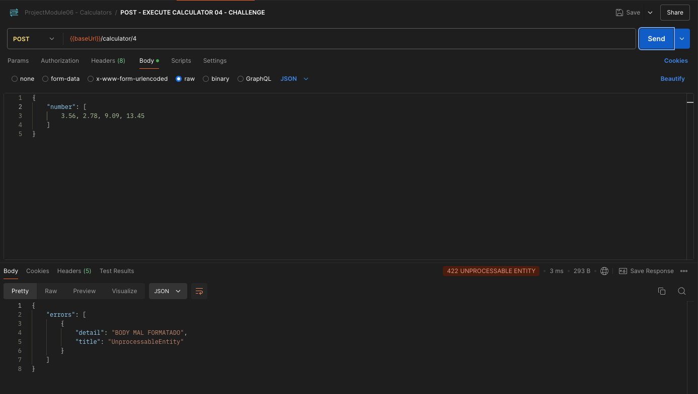

# Desafio 04 - Introdução ao Design de Código
- Nesse desafio será reforçado de forma prática os conceitos que foram apresentados no Módulo 06 - Conceitos de Design.

## Sobre o desafio
- Adicionar uma nova rota que retorne a média entre uma lista de números fornecida em uma requisição POST
- A criação da nova rota deve ser chamada de 'calculator_4' e deve possuir todas as boas práticas conforme ensinado no módulo 06
  - Testes unitários
  - Arquivos separados por responsabilidade
  - Tratamento de erro em caso de um envio de requisição no formato errado

## Rodando a aplicação e executando testes
### Executando a applicação via Postman
  

### Executando testes de integração e unitários
  

### Rodando servidor da aplicação
  

### Geração e teste de erro | status_code = 500 (Server Error)

### Geração de erro | status_code = 422 (Unprocessable Entity)

## Instalando as dependências/bibliotecas necessárias

- Basta aplicar o seguinte comando em seu terminal:
    >
        pip3 install -r requirements.txt

## 🛠️ Ferramentas utilizadas no desafio:

- Flask
- PyTest
- NumPy

## 📚 Conceitos utilizados no projeto:
- Prática de conceitos de design de código
- Criação de rota
- Testes unitários
- Tratamento de erros
- Separação de responsibilidade e melhor organização do cógido