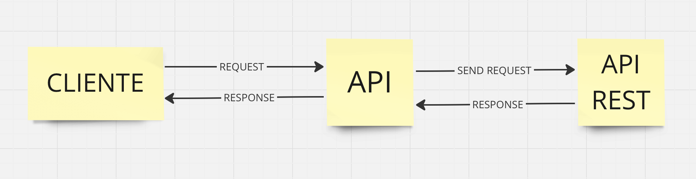

# Módulo 03

- Módulo para desenvolvimento de API's com flask
- Neste módulo será abordado a questão das api's:
  - O que é uma API
  - O que é uma API rest
  - Conceito de requisições
  - Protocolo HTTP
  - Métodos

- Utilização do Python juntamente do framework Flask, para construir uma API funcional.
  - Basicamente essa API funcional será o projeto deste módulo, aonde será basicamente um crud, aonde será construído endpoints para criação, deleção, atualização e leitura.

## Flask

- O que é?
  - **Framework** leve e poderoso para construir aplicações web em python
    - Framework é um conjunto de ferramentas, bibliotecas e convençòes que fornecem uma estrutura para desenvolver aplicações.
- Vantagens:
  - Simplicidade: Uma das vantagens do Flask é a sua simplicidade e sua facilidade no aprendizado. Seu código é legível e intuitivo, tornando-o uma escolha popular para iniciantes e desenvolvedores experientes.
  - Escalabilidade: O Flask pode ser estendido com várias extensões e bibliotecas para adicionar funcionalidades conforme necessário. Isso permite escalabilidade á medida que os projetos crescem.
  - Flexibilidade: O Flask permite aos desenvolvedores escolherem suas próprias ferramentas e bibliotecas para construir aplicações personalizadas. Ele não impõe estruturas rígidas, permitindo uma abordagem mais flexível para o desenvolvimento.

- A idéia por trás do Flask era criar um Framework simples e fácil de usar, mas que também fosse poderoso e capaz de suportar o desenvolvimento de aplicações web robustas. A filosofia central do Flask foi sempre a de manter a simplicidade e fornecer aos desenvolvedores a liverdade para escolherem suas próprias ferramentas e abordagem de desenvolvimento.

- Usos conhecidos: Pinterest, LinkedIn, Netflix e Uber.

### Instalação

- pip3 install Flask, aonde podemos caso necessário passar uma versão especifica.

ou

- criando um arquivo de requisitos e instalando as dependências através do comando pip3 install -r requirements.txt

### Criando arquivo app

- inicialmene criamos o arquivo principal chamado app e nele importamos o flask e criamos uma var app, utilizamos a classe Flask, para criar passando uma varíavel geralmente como __ name __ e quando executamos de modo manual, o __ name __  recebe o valor main
    >
      from flask import Flask

      app = Flask(__name__)

### Rotas

- É como conseguimos comunicar com outros clientes, seja um usuário querendo algum tipo de informação ou usuário acessando aqui via navegador a rota
- A rota ela permite que seja criado uma comunicação, ou seja, receba informações e também devolva informações para quem está solicitando.
- É importante sempre fazer a verificação de que o name seja igual a main e apartir desta verificação, executar nosso programa, pois isto significa que estamos trabalhando localmente.

## API (Application Programming Interface)

- Basicamente a palavra chave em API, é o interface, ou seja, uma porta de entrada, uma forma de estabelecer comunicação.
- CLIENTE --REQUEST--> [ API <--> API Server ]
- O Cliente ele faz uma request para a API, que envia a requisição para o servidor da API e depois que a informação chegar, o servidor vai responder de volta para a API e assim, a mesma responde (response) para o cliente com a informação que ele espera.

  

- API basicamente é um conjunto de regras, protocolos e ferramentas que permitem que diferentes softwares se comuniquem entre si

## API Rest (Representational State Transfer)

- Rest é um estilo de arquitetura, para o desenvolvimento de API's
- Siginifica que ele tem um conjunto de regras, que vai permitir que essa comunicação aconteça de forma fluída.
- Protocolos HTTP e/ou HTTPS
  - Operações ou Métodos -> HTTP Verbs:
    - GET
    - POST
    - PUT
    - DELETE
    - PATCH

- A resposta(response) no estilo REST, obrigatoriamente utilizamos o JSON ou o XML para retornar as informações.

## API vs. API Restful

- Quando uma API ela respeita todos os fundamentos do Rest, ela é nomeada como uma API Restful.

## [Métodos de Requisição HTTP](https://developer.mozilla.org/pt-BR/docs/Web/HTTP/Methods)

- HTTP Verbs:
  - GET: Solicita representação de um recurso específico. **Requisições** utilizando o método GET devem retornar apenas dados.

  - POST: É utilizado para submeter uma entidade a um recurso específico, frequentemente causando uma mudança no estado do recurso ou efeitos colaterais no servidor

  - PUT: Substitui todas as atuais representações do recurso de destino pela carga de dados da requisição.

  - DELETE: Remoce um recurso específico.

  - PATCH: É utilizado para aplicar modificações parciais em um recurso.

## [Códigos de Status de respostas HTTP](https://developer.mozilla.org/pt-BR/docs/Web/HTTP/Status)

- As respostas são agrupadas em cinco faixas:

  - Respostas afirmativas -> 100 a 199

  - Respostas bem-sucedidas -> 200 a 299

  - Mensagens de redirecionamento -> 300 a 399

  - Respostas de erro do cliente -> 400 a 499

  - Respostas de erro do servidor -> 500 a 599

## Documentação de API

- É importante em dois momentos:

  1. A documentação é importante antes da API ser construída, para que possamos ter toda a visualização de como os endpoints vão funcionar, quais sào os tipos de respostas e quais são os tipos de parâmetros que podemos receber.

  2. É quando a API já foi construída é importante, pois diversos interessados (stakeholders) na API farão o uso da documentação para entender como a API funciona.

- Swagger: Uma das principais ferramentas de documentação de API.

## GIt, Github x Gitlab x Bitbucket

- Git: Software de versionamento de código

  - [Instalação/Download](https://www.git-scm.com/download/mac):
    - brew install git => maneira que eu utilizei no momento

- Softwares que utilizam do git por trás:
  - Github

  - Gitlab: Utiliza o GIt por trás, porém, o que diferencia ele do Github, por exemplo é que ele tem uma esteira de CI e CD para implementação do código e tudo meio que acoplado.
    - Amplamente utilizado em empresas.

  - Bitbucket: Também tem o Git por trás e também muito utilizado por empresas, porque ele tem também uma grande intergração com outro software, chamado Jira que serve para fazer controle de atividade dentro dele, principalmente quem roda em métodos ágeis e tudo mais.

## COMMANDS GIT

- Segue uma pequena lista dos comandos para utilizar o [Git](https://github.com/joshnh/Git-Commands/blob/master/READMEpt.md)

## DOCS

- Nos casos de registros de alterações, documentações ou ate criação de readme, geralmente é utilizado o padrão [markdown](https://www.markdownguide.org/basic-syntax/), o qual facilita muito a manipulação dos documentos e também bem mais apresentável.

## CRIANDO AS 'VERB ACTIONS' DO PROJETO

- CRIANDO UMA TAREFA
    >
      @app.route('/tasks', methods=['POST'])
      def create_task():
        global task_id_control
        data = request.get_json()
        new_task = Task(id=task_id_control,title=data.get('title'), description=data.get('description',''))
        task_id_control += 1
        tasks.append(new_task)
        print(tasks)
        return jsonify({'message': 'Nova tarefa criada com sucesso'})

- LISTANDO TODAS AS TAREFAS

  &nbsp;

  - PRIMEIRA FORMA DE RETORNAR TODA A LISTA
      >
        app.route('/tasks', methods=['GET'])
        def get_tasks():
            task_list = []
            for task in tasks:
                task_list.append(task.to_dict())

            output = {
                "tasks": task_list,
                "total_tasks": 0
            }

            return jsonify(output)

  &nbsp;

  - SEGUNDA FORMA DE RETORNAR TODA A LISTA
      >
        @app.route('/tasks', methods=['GET'])
        def get_tasks():
            task_list = [task.to_dict() for task in tasks ]

            output = {
                "tasks": task_list,
                "total_tasks": 0
            }

            return jsonify(output)

    - Nesta forma estamos criando uma lista aonde estamos iterando cada task presente nas tasks e retornando a cada iteração, o task.to_dict()

- LISTANDO UMA TAREFA EM ESPECÍFICO ATRAVÉS DO ID
  - após a criação da rota, passaremos um identificador através dos sinais de <>, passando duas informações, onde a primeira será o tipo do parâmetro que será recebido e a segunda informação será o nome dado para a informação. Logo em seguinda passamos o método que será utilizado.
      >
        @app.route('/tasks/<int:id>', methods=['GET'])
        def get_task(id):
            for t in tasks:
                if t.id == id:
                    return jsonify(t.to_dict())
                
            return jsonify({'message':'Não foi possível encontrar a atividade'}), 404

- [PARÂMETROS DE ROTAS NO FLASK](https://flask.palletsprojects.com/en/3.0.x/quickstart/#routing)
  - Permite que receba na rota alguma varíavel dos seus usuários/clientes que estão fazendo a requisição.
