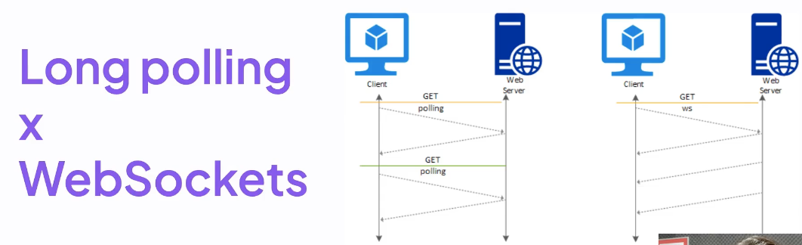

# Módulo 05 - Notificações em tempo real

- Neste módulo, o foco será de explorar o conceito de notificações em tempo real e suas aplicações, além de discutir as estratégias mais comuns para implementá-las, como long polling e WebSockets.

## Notificações em tempo real

- Basicamente um sistema que implementa notificações em tempo real, ele tem a capacidade de enviar informações imediatas e também informações(dados) em tempo real para os clientes conectados a uma aplicação web.

- Esses clientes(usuários) que estão conectados vão receber as notificações sem precisar, ficar atualizando a página a todo momento.

- Porque é útil?
  - Porque fornece atualizações instantâneas aos usuários sem que eles tenha que atualizar manualmente a página.

- Tecnologia WebSockets
  - Um protocolo de comunicação bidirecional, ou seja, que permite que os dois lados, o cliente e o servidor se comuniquem entre si, através de uma comunicação eficiente e em tempo real.

    

  - Latência é a mínima possível
    - latência é tempo que demora para a informação 'ir e voltar'.

  - Exemplos de aplicações
    - Aplicações de Chat em tempo real
    - Rastreamento de Atividades
    - Colaboração em tempo real

## Long polling vs. WebSockets

1. Long polling

   - A requisição vem do client para o servidor, toda vez que preciso dessa informação atualizada
   - Exemplo: Toda vez que preciso ver meu saldo atualizado em uma aplicação, eu precisaria clicar em um botão e no momento que o botão é clicado, uma requisição vai no servidor e o sevidor vai processar essa informação e devolve a mesma atualizada

   - No LP há um grande overhead na rede, pois toda vez estamos abrindo/enviando conexões  ou requisições para o sevidor e o servidor processa e envia a informação para o client
   - Essa ação tem um custo de rede, de dado tráfegado (grandes clouds), tem custo de processamento.

2. WebSockets

   - É efetuado uma única o vez o Hand shake, ou seja, assim que a conexão for estabelecida, o servidor consegue enviar várias informações para o client, da mesma forma que o client consegue enviar para o sevidor.

3. Conclusão

   - O uso do WebSockets proporciona uma experiência mais fluida e eficiente em notificações em tempo real
  

## CRIAÇÃO DAS ROTAS

1. ROTA DE CRIAÇÃO DE PAGAMENTO

   - /payments/pix
     - nesta rota de pagamentos, foi especificado o método(pix), porque quando falamos da parte de pagamentos, hoje nós temos sistemas que lidam com diversos tipos de pagamentos e então o que acontece, é que pode ter pagamentos em pix, por via de boletos, pagamento por cartão de crédito e muitos outros métodos e se caso for criado tudo dentro de uma rota só, o que pode acontecer, é que vai ser criado uma dependência entre os sistemas e as rotas, deta forma, quando for adicionar um novo método de pagamento, vai ser obrigado a alterar a rota criada, criando assim um acoplamento entre os meios de pagamento
     - Para evitar essa situação, é muito mais fácil criar novas rotas evidenciando o método de pagamento, pois, assim evita essa situação de acoplamento e assim evolui toda a aplicação sem deixar a desejar futuramente.

2. ROTA PARA CONFIRMAÇÃO DO PAGAMENTO

   - /payments/pix/confirmation
     - para o método pix, toda vez que ele é efetuado/gerado, a instituição recebe a informação dizendo se esta tudo certo e que o pagamento foi efetuado.
     - Rota vai permitir que a instituiçào nos avise que ela recebeu o pagamento.

3. ROTA PARA VISUALIZAR AS INFORMAÇÕES DO PAGAMENTO

   - 
