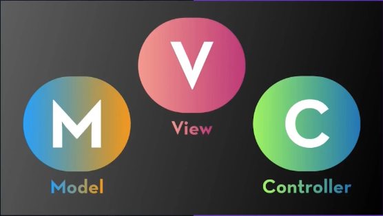
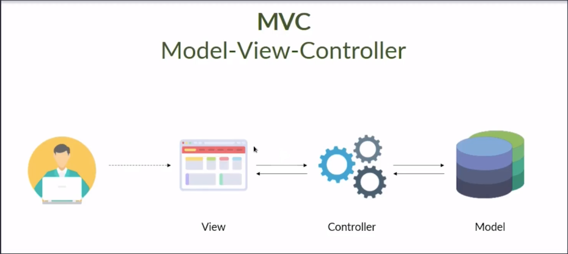

# Arquitetura de Software e Padrão MVC

## Introdução ao Padrão MVC

- O Padrão MVC (Model-View-Controller) foi introduzido por um engenheiro norueguês em 1978 e é amplamente utilizado na organização de código de sistemas que envolvem interface do usuário e lógica de negócio. O padrão separa as responsabilidades em três componentes principais: model, view e controller. A view lida com a interface de usuário, o controller processa as entradas do usuário e utiliza o model conforme necessário e o model gerencia os dados do aplicativo. O MVC é comum em diversas linguagens e frameworks como Django, Spring Boot e Laravel.

## Responsabilidades do Padrão MVC

- Views
  - A view é responsável por apresentar os dados de resposta e por lidar com a interface de interação com o usuário. O usuário geralmente interagi com essa camada aqui de View e esta mesma tem a responsabilidade de mostrar um dado para o usuário, de receber um dado do usuário e fazer essa troca de informações diretamente com o usuário.

- Controllers
  - O Controller recebe as entradas do usuário da View, processa essas entradas e atualiza o Model conforme necessário. O Controller armazena a regra de negócio do sistema, ou seja, na view é recebido os dados do usuário e recebendo esses dados, vai ser enviado para o controller, aonde vai ter todo o tratamento desses dados.

- Model
  - O Model é responsável por armazenar e gerenciar os dados do aplicativo, bem como fornecer métodos para acessar e manipular esses dados.
  - Camada para interagir com banco de dados, para armazenar elementos que serão importantes para a aplicação e para quem está desenvolvendo, obtendo assim essa persistência de dados.
  - O Model, pode ter também uma lógica para armazenamento em diversos outros locais, como por exemplo: CSV, arquivos de texto.

## Ambientes Virtuais

- Sempre existe aquela questão de executar um projeto e logo em seguida outro desenvolvedor ou colega de equipe, vai tentar executar o mesmo projeto e acaba resultando em algo insperado e não roda o projeto e isso acontece justamente por serem máquinas diferentes, com versões diferentes e até mesmo OS diferentes, desta forma, para que isso não venha ocorrer, podemos utilizar os ambientes virtuais.
- Estaremos utilizando aqui neste módulo o Virtualenv, que o próprio python nos oferece.
- instalação: mas para instalar unicamente o virtualenv, basta digitar pip3 install virtualenv
- para inicializar e criar o ambiente virtual:
  - python3 -m venv nome_do_ambiente_virutal
  - por convenção, utiliza-se venv, mas isso fica a critério do usuário no momento da inicialização
- Ativação
  - após a inicialização do ambiente virtual, é preciso ativar o mesmo e para isso, basta digitar o seguinte comando(neste passo, pode depender do seu OS):
  - default:
      - source nome_do_ambiente_virtual/bin/activate
     
    - Windows:
      - nome_do_ambiente_virtual\Scripts\Activate

- Desativando o ambiente virtual => basta digitar deactivate

- ### Instalando dependências do projeto
- Geralemente em projetos que utilizam ambientes virtuais, os desenvolvedores armazeam todas libs e suas versões em um arquivo, através do seguinte comando:
  - venv/bin/pip3 freeze > nome_do_arquivo.txt
- Este passo serve para facilitar a instalação e configuração do projeto, por outros usuários que forem validar ou testar a aplicação em si.
- Para rodar e instalar todas essas dependências, basta executar o seguinte comando em seu terminal:
  - pip3 install -r nome_do_arquivo.txt
    ou
  - pip3 install -r nome_do_arquivo.txt --update

- Após este passo, a aplicação vai estar atualizada e pronta pra executar.

## Pylint
- Ele busca analisar erros, impõe um padrão de codificação, procura por code smells e pode fazer sugestões sobre como o código pode ser refatorado.
  - code smells: São características no código-fonte de um programa que podem indicar um problema mais profundo. Eles podem ser um sinal de que as boas práticas de design não foram aplicadas, mas não necessariamente um bug no sistema.
- Para separar todas as regrar que o pylint possui, iremos aplicar o seguinte comando: pylint --generate-rcfile > .pylintrc
- Para que não ocorra de ter arquivos sem a configuração do Pylint no projeto, será aplicado uma proteção para o nosso código, aonde o pylint irá passar por todo o projeto identificando o que não está de acordo com a formatação e assim, podendo ser corrigido
  - Para isso, iremos adicionar ao projeto aqui, relacionado a pasta Git, um hook
  - [Pre-commit](https://pre-commit.com/)
    - Em outras palavras, Git hook scripts são úteis para identificar problemas simples antes do envio para o 'code review'. Os hooks são executados em cada commit para apontar automaticamente problemas no código, como ponto e vírgula ausente, espaços em branco à direita e instruções de depuração. Ao apontar esses problemas antes da revisão do código, isso permite que um revisor de código se concentre na arquitetura de uma mudança sem perder tempo com detalhes triviais de estilo.
  - Instalação
    - pip3 install pre-commit