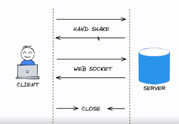
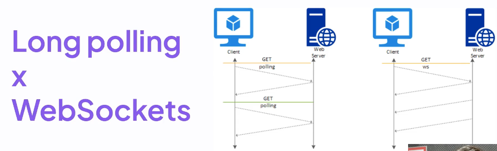

# Módulo 05 - Notificações em tempo real

- Neste módulo, o foco será de explorar o conceito de notificações em tempo real e suas aplicações, além de discutir as estratégias mais comuns para implementá-las, como long polling e WebSockets.

## Notificações em tempo real

- Basicamente um sistema que implementa notificações em tempo real, ele tem a capacidade de enviar informações imediatas e também informações(dados) em tempo real para os clientes conectados a uma aplicação web.

- Esses clientes(usuários) que estão conectados vão receber as notificações sem precisar, ficar atualizando a página a todo momento.

- Porque é útil?
  - Porque fornece atualizações instantâneas aos usuários sem que eles tenha que atualizar manualmente a página.

- Tecnologia WebSockets
  - Um protocolo de comunicação bidirecional, ou seja, que permite que os dois lados, o cliente e o servidor se comuniquem entre si, através de uma comunicação eficiente e em tempo real.

    

  - Latência é a mínima possível
    - latência é tempo que demora para a informação 'ir e voltar'.

  - Exemplos de aplicações
    - Aplicações de Chat em tempo real
    - Rastreamento de Atividades
    - Colaboração em tempo real

## Long polling vs. WebSockets

1. Long polling

   - A requisição vem do client para o servidor, toda vez que preciso dessa informação atualizada
   - Exemplo: Toda vez que preciso ver meu saldo atualizado em uma aplicação, eu precisaria clicar em um botão e no momento que o botão é clicado, uma requisição vai no servidor e o sevidor vai processar essa informação e devolve a mesma atualizada

   - No LP há um grande overhead na rede, pois toda vez estamos abrindo/enviando conexões  ou requisições para o sevidor e o servidor processa e envia a informação para o client
   - Essa ação tem um custo de rede, de dado tráfegado (grandes clouds), tem custo de processamento.

2. WebSockets

   - É efetuado uma única o vez o Hand shake, ou seja, assim que a conexão for estabelecida, o servidor consegue enviar várias informações para o client, da mesma forma que o client consegue enviar para o sevidor.

3. Conclusão

   - O uso do WebSockets proporciona uma experiência mais fluida e eficiente em notificações em tempo real
  

## CRIAÇÃO DAS ROTAS

1. ROTA DE CRIAÇÃO DE PAGAMENTO

   - /payments/pix
     - nesta rota de pagamentos, foi especificado o método(pix), porque quando falamos da parte de pagamentos, hoje nós temos sistemas que lidam com diversos tipos de pagamentos e então o que acontece, é que pode ter pagamentos em pix, por via de boletos, pagamento por cartão de crédito e muitos outros métodos e se caso for criado tudo dentro de uma rota só, o que pode acontecer, é que vai ser criado uma dependência entre os sistemas e as rotas, deta forma, quando for adicionar um novo método de pagamento, vai ser obrigado a alterar a rota criada, criando assim um acoplamento entre os meios de pagamento
     - Para evitar essa situação, é muito mais fácil criar novas rotas evidenciando o método de pagamento, pois, assim evita essa situação de acoplamento e assim evolui toda a aplicação sem deixar a desejar futuramente.

2. ROTA PARA CONFIRMAÇÃO DO PAGAMENTO

   - /payments/pix/confirmation
     - para o método pix, toda vez que ele é efetuado/gerado, a instituição recebe a informação dizendo se esta tudo certo e que o pagamento foi efetuado.
     - Rota vai permitir que a instituiçào nos avise que ela recebeu o pagamento.
     - No mercado esse tipo de rota de confirmação é conhecida como Webhook, aonde iremos receber uma notificação de uma instituição financeira e como a instituição sabe qual é a rota que ela tem que enviar, eventualmente eles chamam essa funcionalidade de Webhook, pois, eles enviam essa informação quando eles já tem essa informação

3. ROTA PARA VISUALIZAR AS INFORMAÇÕES DO PAGAMENTO

   - /payments/pix/<int:payment_id>
     - Rota para trazer as informações de pagamento de maneira visual para o cliente.
     - Rota que será estabelecido a conexão com o WebSockets

## [UUID](https://docs.python.org/3/library/uuid.html)

- Identificador único e universal
- Existem diversas formas de gerar o UUID, como por exemplo: 
  - No Host ID da máquina no tempo atual, ajudando assim a ter menos conflitos
    - uuid.uuid1()
  - Podemos gerar um UUID usando o MD5 hash de um UUID de namespace e um nome
    - uuid.uuid3(uuid.NAMESPACE_DNS, 'python.org')
  - Podemos gerar usando o UUID random
    - uuid.uuid4()
  - Podemos gerar com base em alguma mensagem

## Virtualenv

- **instalação**: pip3 install virtualenv
- **Create and Use Virtual Environments**
  - python3 -m venv .venv
- **Activate a virtual environment**
  - source .venv/bin/activate

## [Template](https://github.com/GabrielCasemiro/py-payment) Página de Pagamento

- Template da página de pagamentos em HTML e CSS, modelado pela equipe da Rocketseat

## Retornando uma página (HTML)

- Neste ponto estaremos retornando um página dentro do projeto, para retornar as informações para o usuário
- Porém, estaremos mostrando tanto o front-end quanto o back-end no mesmo lugar
  - Isto está sendo feito, para que possa ser visualizado de maneira única o funcionamento do WebSocket
  - Mas em uma versão ao qual teremos uma API dedicada somente para isso, provavelmente terá um front-end separado, que vai fazer a comunicação com o back-end, para que assim seja feita a confirmação.

- Por mais que tudo esteja sendo feito dentro da mesma aplicação, mas o funcionamento é exatamento o mesmo.

- Para retornar o template que clonamos, iremos utilizar uma função do Flask chamada render_template() e passar como parâmetro o endereço do arquivo(página) dentro do repositório templates que criamos.

- Para importar toda a estilização da página, estaremos utilizando o projeto que já esta incorporado dentro do Flask, ao qual projeto se chama jinja2
  - Para utilizar marcações precisamos utilizar -> {{}}
  - Função que iremos utilizar para chamar neste caso as estilizações é o url_for(), ao qual recebe dois parâmetros
    - aonde o primeiro é a pasta
    - segundo o arquivo em si
    - resultando no seguite formato -> {{ url_for('static', filename = 'css/styles.css') }}

## Conexão Cliente x Servidor

- Para essa conexão aconteceer é preciso criar uma rota que permita o cliente s conectar com o nosso servidor
- [Flask-SocketIO](https://flask-socketio.readthedocs.io/en/latest/)
  - Biblioteca que permite criar a rota que comentamos e que os clientes consigam se conectar

- Lembramos que as informações podem ser enviadas de forma bidirecional, tanto cliente pode enviar para o servidor, quanto o servidor pode enviar para o cliente.
- Mas porque tudo isso?
  - Basicamente quando o cliente realzar o pagamento, iremos notificar o mesmo que o pedido foi pago, ou seja, o pagamento foi detectado e pago com sucesso em tempo real.
  
## Notificando o cliente com pagamento confirmado

- Através do Socketio, tem uma função chamada emit(), que basicamente emite uma notificação para todos os clientes conectados.
- Na aplicação que estamos constuindo, iremos utilizar esta função e ao mesmo tempo passar uma mensagem de maneira específica ao pagamento que foi realizado, através do id do pagamento.
- Para uma experiência em tempo real, utilizaremos o método location.reload(), para atualizar a página assim que o pagamento for confirmado.

## Aplicação de testes unitários

- Ao tentarmos acessar dentro do teste, por exemplo a parte se salvar a imagem do qrcode que foi gerada para pagamento, dará um pequeno problema, aonde não será encontrado o diretorio e quando tentamos criar um arquivo fora do contexto do Flask, justamente a pasta não será encontrada, pois, ele estará tentando achar esta pasta dentro da pasta de test.
- para solucionar essa questão, como por exemplo dentro do pix, estamos passando um caminho relativo, desta forma, precisamos estar dentro do contexto da aplicação Flask para que possamos encontrar a pasta static (pata criada para armazenar arquivos de estilização e imagens desta aplicação), presente na raiz da aplicação e o que possamos fazer para arrumar essa parte do test, é passar um diretorio base, para que a aplicação possa encontrar o diretorio procurado.
- Como na criação do pagamento é retorno tanto o bank_payment_id quanto o qr_code_path, na hora de implementar o test, é preciso validar se essas informações são rertonadas corretamente, da seguinte forma:

    >
      assert 'bank_payment_id' in payment_info
      assert 'qr_code_path' in payment_info

- Para verificar se a imagem para o pagamento foi gerada e salva corretamente, dentro do teste, podemos aplicar da seguinte forma:

    >
      qr_code_path = payment_info['qr_code_path']
      assert os.path.isfile(f'../static/img/{qr_code_path}.png')