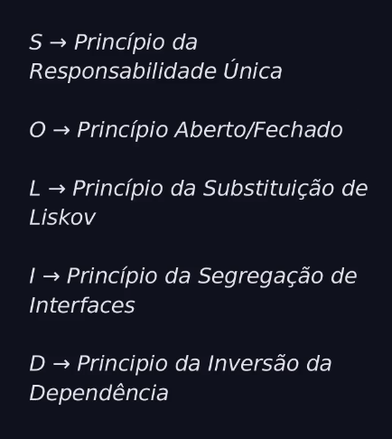
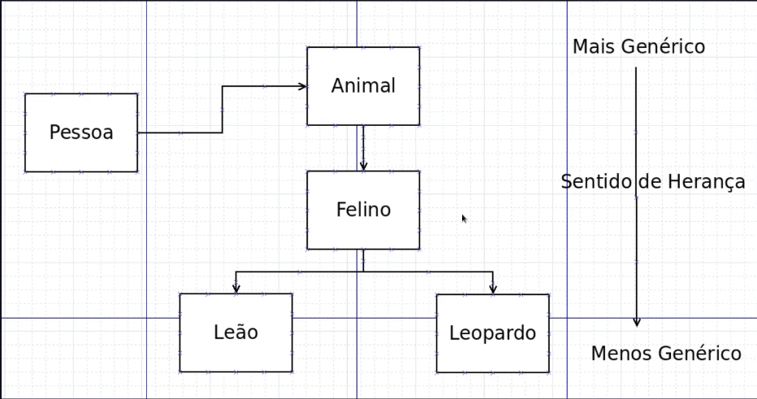

# Módulo Conceitos S.O.L.I.D

- São 5 príncipios de desing de classes orientados a objetos
- Esses cinco príncipios nos ajudam a entender a necessidade de determinados padrões de projetos e arquitetura de software em geral

## S.O.L.I.D

## S - Single Responsibility Principle (SRP) | Princípio da Responsabilidade Única

- "Um módulo deve ter um e apenas um, motivo para alteração"
- Um módulo deve ser especializado em um único assunto e possuir apenas uma única responsabilidade dentro do seu software
- "Um módulo é apenas um conjunto coeso de funções e estrutura de dados"
- O SRP destaca a importância de uma classe ter uma única razão para mudar. Isso significa que uma classe deve ter apenas uma responsabilidade.

 

## O - Open/Closed Principle (OCP) | Princípio Aberto/Fechado

- "Um artefato de software deve estar aberto para extensão, mas fechado para modificação"
- "Em outras palavras, o comportamento de um artefato de software deve ser extensível, sem ter que modificar esse artefato."
- O OCP enfatiza que uma classe deve estar aberta para extensão, mas fechada para modificação. Em outras palavras, você pode adicionar novos comportamentos sem alterar o código existente.
  
 

## L - Liskov Substitution Principle (LSP) | Princípio da Substituição de Liskov

- Princípio que ajuda na parte de Heranças em OO
- Barbará Liskov
- Objetos podem ser substituídos por seus subtipos sem que isso afete a execução correta do programa
- O LSP pode e deve ser estentido ao nível da arquitetura. Uma simples violação de substituição, pode fazer com que a arquitetura de um sistema seja poluída com uma quantidade significativa de mecanismos extras.

- Princípio da substituição
  - No exemplo abaixo, sempre que uma pessoa estiver interagindo um tipo(animal), os tipos de baixo devem manter o mesmo padrão
  - Podemos relacionar o felino com uma instância de Pessoa, como também podemos relacionar um Leão ou um Leopardo, como segue no exemplo a baixo.
  
  

 

## I - Interface Segregation Principle | Princípio da Segregação de Interfaces

- Ajuda muito ao trabalhar com interfaces ou criar interfaces
- Uma classe não deve ser forçada a implementar interfaces que ela não utiliza
- Em vez disso, as interfaces devem ser segregadas em conjuntos menores e mais específicos de métodos.

 

## D - Dependency Inversion Principle | Princípio da Inversão da Dependência

- Módulos de Alto Nível não devem depender diretamente dos módulos de baixo nível
- " O Príncipio da Inversão da Dependência (DIP) nos diz que os sistemas mais flexíveis são aqueles em que as dependências do código-fonte referem-se apenas a abstrações, não a concreções. "