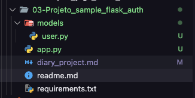

# Projeto Sample Flask Auth

- Antes de iniciar, é importante entender o papel do banco de dados na persistência das informações. Em alguns projetos que eu desenvolvi, muitos dados foram armazenados em estruturas de dados do Python, como listas e dicionários. Isso ocorre porque essas dados são armazenados na memória RAM, que é volátil e não persiste os dados. Para contornar essa situação, foi utilizado o banco de dados, que é uma ferramenta para persistir informações.

- Existem diferentes tipos de Banco de Dados:
  - MySQL
  - PostgreSQL
  - SQLite
  - MongoDB
  - Amazon Aurora
  - Amazon DynamoDB

- Durante o projeto, estarei utilizando o SQL Alchemy, que é uma extensão do Flask que suporta o SQL ALchemy.
  - O SQL Alchemy é um ORM (Object Relational Mapper), que permite abstrair as funções do banco de dados e facilita a troca de banco de dados no futuro.

- O [Flask SQL Alchemy](https://flask-sqlalchemy.palletsprojects.com/en/3.1.x/) não é um **Banco de Dados**. Ele é apenas uma ferramenta ORM que ajuda a conectar e realizar as interações dentro do projeto.

- Durante o projeto, foi orientado a utilização do SQLite, que é uma ótima opção para projetos de desenvolvimento, segundo o Professor, pois é leve e fácil de usar. No entanto, não é adequado para aplicação em produção, devido as limitações de gerenciamento de requisições concorrentes.

## Pontos importantes

- Para organizar melhor a estrutura do nosso código, estarei trabalhando com a estrutura de módulos e componentes em aplicações separadas
- Escrever todo nosso código em um arquivo só, não é considerado uma boa prática.
- Um exemplo claro, é que estaremos criando uma pasta models, dentro da nossa aplicação e logo em seguida, criamos o model usário.

  

- Para este caso não teremos problema ao importar o db dentro do arquivo 'user.py', porque a codicional de inicialização da applicação esta dentro do arquivo 'app.py'
- É muito comum e importante saber que arquivos importem variáveis de dentro do arquivo app, isso é muito comum no Flask.
- Organizar componentes com base na taxa de atualização.

## Classe UserMixIn

- Importada da biblioteca flask_login
- Essa classe ela traz todas as informações ou métodos prontos para interagir com as informações passadas na autenticação do usuário, como por exemplo, autenticação do usuário, se o usuário está ativo ou não e muitas outras.

## Criação do Banco de dados (DB)

- no terminal acessar o shell do flask => flask shell
- ao acessarmos, estaremos rodando uma instância da minha aplicação, ou seja, é como se eu estiversse dentro do meu código em tempo real.
- Criando o DB
    >
      db.create_all()

  - Este comando vai criar meu banco de dados.

- Porém temos que nos preocupar com uma outra questão, que é a seguinte:
  - Todo banco de dados quando abrimos uma conexão com ele, o mesmo cria um conceito que chamamos de session
  - Esta session armazena nossa conexão ativa, ou seja, quando eu abro a conexão com o banco de dados, que tem um tempo limite, tem as propriedades da mesma, temos que nos preocupar com a session, pois é com a session que conseguimos de fato dar os comandos dentro do meu banco de dados.

- Quando nos conectamos com banco de dados, criamos uma sessão e quando saimos, a mesma se fecha.
- Não é orientador ter muitas sessões abertas do banco de dados.
- Cada banco de dados tem suas peculiaridades, alguns aguentam muitas sessões simultâneas e outros não.
- db.session => instância dentro do nosso db
- através dele temos acesso a outro método, que é o commit()
    >
      db.session.commit()

  - esse commit() é bem parecido com o commit do git, basicamemte o que ele faz, é pegar tudo que foi feito na sessão que está ativa e vai de fato executar o comando no banco de dados.

  - esse comando é uma característica que precisamos prestar atenção, principalmente no tipo de banco que estamos trabalhando, que no caso é o relacional, que armazena informações em tabelas e essas tabelas podem se relacionar entre si.

## Biblioteca [Flask-login](https://flask-login.readthedocs.io/en/latest/)

- Essa biblioteca fornece um gerenciamento da seção de usuário.
- Permite que seja disponibilizado um login e um logout para o usuário, proteger algumas rotas, para que somente usuários logados conseguem acessar e também extender essas funcionalidades, como por exemplo, permissões e tudo mais.

- Importação loginManger:
    >
      from flask_login import LoginManager

  - A Classe LoginManager, é responsável por fazer o gerenciamento da gestão do usuário.

- login_user()
  
  - realizar procedimento de autenticação do usuário.

- current_user
  
  - Recuperando o usuário 'current', após a autenticação.
  - uma propriedade que pode auxiliar neste processo, é o is_authenticated

- user_loader(callback)
  
  - Vai carregar a seção do usuário
  - Essa função tem que retornar o ID do usuário e isso vai permitir que verifique o mesmo em várias outras etapas.

## Criando um registro user no banco

- acessar shell => flask shell
- criar um user
  - user = User(username="admin", password="123")

- usando o SQLALchemy para cadastrar:
  - Através da session e do método add
      >
        db.session.add(user)

    - basicamente adicionou no banco de dados um objeto recem criado.

- Realizar o commit() para salvar no banco.
    >
      db.session.commit() 

## Função logout_user()

- Função importada da biblioteca flask_login
- Precisamos ter ciência que nesta função temos que ter o entendimento que para ser efetuado o logout, inicialmente o usuário precisa ter feito o login
- Para isso o flask_login ele ajuda a verificar e proteger a rota '/logout' que criamos, de usuários que não estão autenticados.
- Através do decorator login_required, conseguimos utilizar o mesmo em cima da declaração da função de logout, para que assim, a rota seja protegida dos usuários não autenticados.
- Após 'acessar' rota de logout, ou seja, ter efetuado logout do usuário, basicamente a session será 'limpada', aonde o navegador enviará um sinal para que os cookies sejam limpos e a partir dai não teremos mais as informações do usuário que estava logado
- Justamente isso reflete no controle interno da ferramenta.

## Abordagens sistemas de cadastro

- Cadastro interno, ou seja, so podem ser cadastrados pessoas apartir de uma pessoa que já esteja autenticada e ai sim temos um tipo de sistema muito mais direcionado para empresas e sistemas internos de empresas.

- Sistemas empresariais, aonde é permitido qualquer um se registrar, com um nível de acesso mais baixo, ou seja, o usuário pode se registrar no sistema, mas não pode realizar uma inserção no sistema, uma edição ou deleção, pois, essas ações são voltadas para as pessoas que tem um nível mais elevado.

## Curiosidades

- Uma curiosidade sobre o próprio flask, que no caso se o usuário esquecer de repassar uma informação na hora de realizar a requisição, o próprio flask, efetua o lembrete através de uma mensagem de advertência, mostrando que faltou informações no momento de realizar a requisição.