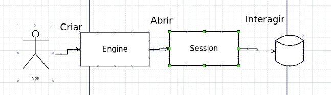

# Projeto Find A Friend

## Definição do Banco de Dados

- Bando de dados [SQLite](https://www.sqlite.org/):
  - É um Banco sql
  - A mesma linguagem que geralmente temos para os outros bancos teremos aqui também no SQLite
  - Ele é considerado 'pequeno', rápido, bonito, cheio de features
  - Este banco ira simplificar e ajudar bastante durante o desenvolvimento do projeto.

## SQLAlchemy
- Python SQL Toolkit, em outras palavras é o kit de ferramentas SQL do python e Object Relational Mapper que da aos desenvolvedores de aplicativos todo o poder e flexibilidade do SQL
- O SQLAlchemy fornece um conjunto completo de padrões de persistência de nível empresarial bem conhecidos, projetados para acesso eficiente e de alto desempenho ao banco de dados, adaptados em uma linguagem de domínio simples e Pythonic.

## DBeaver
- Gerente de banco de dados
- Busca demonstrar ou ajudar a entender visualmente como que é o DB 

## Estrutura do Projeto
- Ao criar uma pasta src, dentro da mesma, já começamos a aplicar o padrão MVC, criando assim uma pasta models
  - Podemos ter uma aplicações se conectando à vários bancos, por exemplo: podemos ter uma aplicação se conectando a um sqlite e depois a um MariaDB, MySQL ou qualquer outro banco. Com base nesse conhecimento, neste projeto, estaremos utilizando o sqlite, como já visto anteriormente, desta forma, dentro de models, iremos criar uma pasta sqlite
    - Separando agora responsabilidades na integração com o banco de dados, iremos criar mais 3 pastas:
      - Settings: com o objetivos de definir conexões e afins.
      - Entities: com o objetivo de definir as entidades, ou seja, o espelhamento com o banco de dados.
      - Repositories: Serão os repositórios, ou seja, as ações que iremos fazer no banco.

## Interação SQLAlchemy com DB

- Primeiramente é criado uma engine de conexão (criar a Conexão com o DB)
- Depois é aberto uma sessão, ou seja, essa sessão vai ser exatamente o momento em que estamos disponíveis a fazer ações no DB e dentro das sessões de fato, iremos conseguir fazer alguns comandos SQL no DB

## Testes unitários
- Estaremos utilizando aqui no projeto, a lib [Pytest](https://pypi.org/project/pytest/)
- [Documentação](https://docs.pytest.org/en/stable/#)
- instalação: pip3 install -U pytest

## Entities
- Para o SQLAlchemy saber que temos as tabelas people e pets, é preciso definir os elementos, essas tabelas para nosso código, eles precisam de alguma forma enxergar que existem essas tabelas.
- É o espelho de todos os elementos de armazenamento
- Neste projeto, os elementos de armazenamento serão people e pets
- Basicamente a definição/criacão das entities people e pets, será baseado nas informações presentes dentro do arquivo schema.sql
  - people.py
    >
        from sqlalchemy import Column, String, BIGINT, ForeignKey
        from src.models.sqlite.settings.base import Base

        class PeopleTable(Base):
            __tablename__ = 'people'

            id = Column(BIGINT, primary_key=True)
            first_name = Column(String, nullable=False)
            last_name = Column(String, nullable=False)
            age = Column(BIGINT, nullable=False)
            pet_id = Column(BIGINT, ForeignKey('pets.id'))

            def __pepr__(self):
                return f'People [first_name={self.first_name}, last_name={self.last_name}, pet_id={self.pet_id}]'

  - pets.py
    >
        from sqlalchemy import Column, String, BIGINT
        from src.models.sqlite.settings.base import Base

        class PetsTable(Base):
            __tablename__ = 'pets'

            id = Column(BIGINT, primary_key=True)
            name = Column(String, nullable=False)
            type = Column(String, nullable=False)

            """ 
                método especial, para que se ocorra em algum momento
                o print em tela de um elemento da tabela pets, virá da forma definida em repr
            """
            def __repr__(self):
                return f'Pets [name={self.name}, type={self.type}]'

      
## Métodos especiais

- Nesta parte é discutido sobre implementação de funcionalidades elegantes em Python, como o uso do bloco with para tratamento de erros e conexões em banco de dados.

## Repositórios e ações
- Pasta repositories do nosso projeto, vai ter a responsabilidade de mexer com as ações do nosso banco de dados
  - É nesta pasta que serão feitas as seleções, as inserções, as ações de modo geral no banco de dados.

- A ação de deletar(delete), atualizar(update) ou de inserção(insert) no banco de dados, necessita de uma ação muito importante, no SqlAlchemy é necessário efetuar um commit do banco de dados basicamente, ou seja, toda a alteração precisa ser salva

## Testes Unitários em Repositórios

- Teste de integração: São uma parte do ciclo de desenvolvimento de software. Eles visam verificar se diferentes módulos ou componentes do sistema funcionam bem quando combinados. Ao contrário dos testes unitários, que focam em partes isoladas do código, os testes de integração verificam a comunicação entre essas partes.

- ### Características dos Testes de Integração
  - Validação de interfaces: Testam se as interfaces entre módulos funcionam como esperado.
  - Validação de dependências: Garatem que módulos dependentes se comunicam corretamente.
  - Ambiente realista: Muitas vezes são executadas em um ambiente mais proxímo do real para simular a interação real entre os componentes.

## Lib mock-alchemy

- Esta lib fornece uma maneira fácil de simular uma sessão do SQLAlchemy em testes unitários, preservando a capacidade de fazer asserts mais bem fomuladas ou sensatas.