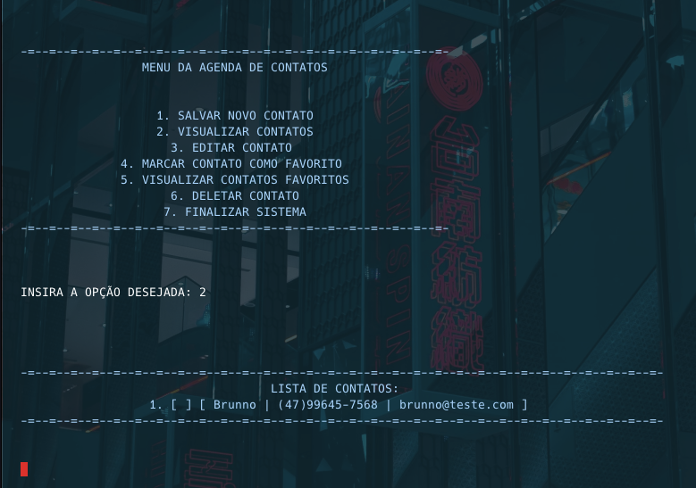

# Desafios e projetos Python 
Repositório criado para armazenar as resoluções dos desafios e projetos que foram desenvolvidos ao longo do estudo aplicado a linguagem Python da Escola Rocketseat.

&nbsp;

## Desafio 01 => Agenda de contatos

**Obs.:** Abaixo estarei demonstrando o funcionamento de algumas funções desenvolvidas no projeto.

### 1. Menu principal

### 2. Listando contatos

### 3. Definindo contato como favorito

### 4, Visualizando contatos favoritos

